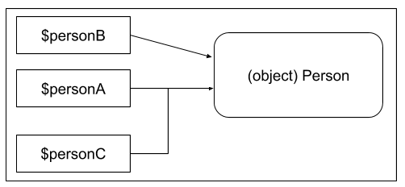

### Facts for Objects and References lesson:

An object is the actual representation or instance of a class.

A reference is an `alias` that enables two different variables to access a single value.

A variable only holds an object identifier that enables object accessors to find a certain object.

An ampersand `&` preceding the dollar sign `$`, which usually precedes a variable name, indicate that the variable will be passed by reference.

When the statement `$personA = new Person();` is executed, the variable `$personA` and the `Person` object are created in the memory. It indicates that the variable `$personA` references or points to the `Person` object as shown below.

The statement `$personB = $personA;` creates the new variable `$personB` in the memory that also references or points to the same `Person` object that `$personA` does as shown below.

Having the statement `$personC = &$personA;` creates the new variable `$personC` as an alias of `$personA` that behaves similarly with what `$personA` does as shown below.

Having another statement `$personA = new Student();`, creates the new `Student` object in the memory that the variable `$personA` now references or points to and `$personC` still behaves as what `$personA` does as shown below.

